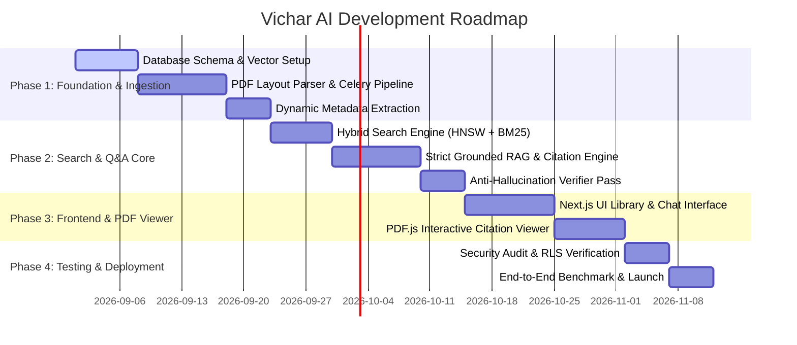

# Product Specifications & Implementation Document: Vichar AI

---

## Executive Summary & Branding

### Official Branding
- **Project Name**: **Project Vichar** (*Open-Source Core Engine*)
- **Product Name**: **Vichar AI** (*AI-Powered Digital Library Platform*)
- **Tagline**: *Grounded Book Knowledge, Smart Library Discovery, and Zero-Hallucination Q&A for Students & Researchers*

---

## 1. Problem Statement & Market Context

### 1.1 The Student & Researcher Challenge
1. **Dense Textbook Navigation Overload**: Students and academics handle hundreds of textbooks, lecture slides, and reference monographs per semester. Finding specific definitions, theorems, or contextual answers requires hours of manual skimming or reliance on primitive Ctrl+F keyword matching.
2. **General AI Hallucination & Lack of Trust**: Popular conversational AI tools (like standard ChatGPT, Claude, or Perplexity) frequently hallucinate academic formulas, cite nonexistent books, or blend external internet noise into answers. Students cannot submit or rely on answers without verifiable, textbook-exact source citations.
3. **Siloed Digital Assets**: PDF textbooks uploaded across courses are isolated files. There is no unified semantic search layer capable of finding related chapters, cross-referencing topics across multiple books (e.g., comparing how *Physics Vol. 1* vs. *Calculus Vol. 2* explains kinematics), and returning exact page downloads.

### 1.2 The Solution: Vichar AI
**Vichar AI** is an intelligent, multi-tenant digital library platform. Students and academic institutions upload PDF textbooks and reference materials. The system processes, parses, and indexes these texts using advanced OCR, layout-aware dynamic chunking, and PostgreSQL `pgvector` HNSW semantic indexing.

Key capabilities:
- **Strict Grounded Q&A**: Answers queries **EXCLUSIVELY** using uploaded book content. If a topic is absent from the uploaded books, the system explicitly refuses to guess.
- **Page-Level Verifiable Citations**: Every generated sentence is mapped back to the precise book title, edition, chapter, and page number with interactive PDF snippet highlights.
- **Cross-Book Semantic Discovery**: Searches across the entire institutional or personal library, ranking related books and chapters matching a concept or natural language query (leveraging the hybrid search engine built in DMS).

---

## 2. Technical Stack & System Architecture

### 2.1 Tech Stack Breakdown

```
[ Frontend ]
  │ ── Next.js 14+ (React, TypeScript)
  │ ── Tailwind CSS + Shadcn UI
  │ ── PDF.js / React-PDF (Interactive In-Browser Viewer with Annotation Highlights)
  │
[ API & Business Logic Layer ]
  │ ── Python 3.11+ / FastAPI (Async ASGI Backend)
  │ ── Pydantic v2 (Strict Schema Validation & API Contracts)
  │ ── LlamaIndex / LangChain (RAG Orchestration & Indexing Engine)
  │
[ Task Processing & Data Pipeline ]
  │ ── Celery + Redis (Asynchronous Ingestion Worker Queue)
  │ ── LlamaParse / Surya OCR / Google Cloud Vision (Complex Layout & Formula Extraction)
  │ ── Marker / Unstructured (PDF Table & Chapter Hierarchy Parser)
  │
[ Data & Vector Storage ]
  │ ── PostgreSQL 16 (Relational Metadata + JSONB Dynamic Fields)
  │ ── pgvector Extension (HNSW Indexing for 1536d / 3072d Vectors)
  │ ── Redis (Layer 0 Semantic Caching & Rate Limiting)
  │ ── AWS S3 / MinIO / Google Cloud Storage (Tenant-Isolated PDF Storage)
  │
[ AI & RAG Engine ]
  │ ── Embedding Models: OpenAI `text-embedding-3-large` or `bge-large-en-v1.5`
  │ ── Re-ranking Layer: Cohere Rerank v3 / BGE-Reranker-Large
  │ ── Foundation LLM: GPT-4o / Claude 3.5 Sonnet (Strictly Prompted with Anti-Hallucination Guardrails)
```

### 2.2 End-to-End System Architecture

```
                    ┌─────────────────────────────────────────┐
                    │       Vichar AI Next.js Frontend        │
                    │  - Library Catalog  - Grounded Q&A Chat │
                    │  - PDF Viewer       - Citation Highlighter │
                    └────────────────────┬────────────────────┘
                                         │ REST / WebSocket
                                         ▼
                    ┌─────────────────────────────────────────┐
                    │             FastAPI Backend             │
                    │  - Authentication   - Tenant Isolation  │
                    │  - Search Router    - Q&A Orchestration │
                    └───────┬─────────────────────────┬───────┘
                            │                         │
            ┌───────────────┴──────┐           ┌──────┴────────────────┐
            ▼                      ▼           ▼                       ▼
   ┌─────────────────┐   ┌──────────────────┐┌──────────────────┐┌───────────┐
   │ S3 / Storage    │   │ Celery Ingestion ││  Redis Cache     ││  Postgres │
   │ Raw Book PDFs   │   │ Workers          ││  (Semantic Layer)││  +vector  │
   └─────────────────┘   └────────┬─────────┘└──────────────────┘└─────┬─────┘
                                  │                                     │
                        ┌─────────┴──────────┐                          │
                        ▼                    ▼                          │
               ┌─────────────────┐  ┌──────────────────┐                │
               │ OCR & Parsing   │  │ Chunking & Embed │────────────────┘
               │ (LlamaParse)    │  │ (LlamaIndex)     │
               └─────────────────┘  └──────────────────┘
```

---

## 3. Core Features & Functional Requirements

### 3.1 Book Ingestion & Smart Structuring Pipeline
- **Multi-Format Upload**: PDF, EPUB, DJVU support with drag-and-drop batch upload.
- **Layout & OCR Awareness**: Parses multi-column textbook layouts, mathematical formulas (LaTeX convertibility), footnotes, tables, figures, and index pages.
- **Hierarchical Document Parsing**: Preserves structural hierarchy (Book -> Volume -> Chapter -> Section -> Subsection -> Page Number).
- **Dynamic Metadata Extraction**: Automatically detects and extracts book metadata upon upload:
  - Title, Authors, Publisher, Publication Year, Edition, ISBN.
  - Academic Subject / Discipline (e.g., *Computer Science, Quantum Physics, Organic Chemistry*).
  - Target Grade / Course Code (e.g., *CS101, PHYS201*).

### 3.2 Cross-Book Semantic & Hybrid Discovery Engine
- **Natural Language Library Search**: Users enter queries like: *"Find textbooks discussing PageRank algorithm and Markov chains."*
- **Hybrid Retrieval (Dense HNSW + Sparse BM25)**: Combines vector similarity with exact term matching for specialized academic terms, formulas, and author names.
- **Dynamic Metadata Filtering**: Filter search results by subject, publication year, author, course code, or specific book collections using PostgreSQL `JSONB` indexes.
- **Book Relevance Ranking**: Aggregates top-matching page chunks up to the book level, listing the most relevant textbooks along with chapter summaries, exact match snippets, and page links.

### 3.3 Strict Book-Grounded Q&A Engine (Zero-Hallucination Protocol)
- **Strict Content Boundary**: The system answers questions **ONLY** using facts explicitly present in the selected or indexed books.
- **Refusal & Scope Enforcement**: If a user asks a question not covered in the library (e.g., *"What is the recipe for chocolate cake?"* in a Medical Physiology library), the engine returns:
  > *"Information Not Found: The uploaded books in your library do not contain details regarding this topic. As per safety guardrails, I cannot generate an answer outside your uploaded material."*
- **Interactive Inline Citations**: Every claim in the generated answer includes clickable citation badges (e.g., `[Calculus 11th Ed., Ch. 4, p. 142]`). Clicking the badge opens the exact page in the integrated PDF reader with the source sentence highlighted.
- **Multi-Book Comparative Synthesis**: Ability to compare perspectives or proofs across multiple books (e.g., *"Compare how Book A and Book B define the Second Law of Thermodynamics"*).

---

## 4. Implementation Plan & Detailed Modules

Following the proven architecture from the DMS codebase, the implementation is broken down into 6 core technical modules:

### Module 1: Database Schema & Tenant Storage Engine
Implement isolated multi-tenant relational and vector schema in PostgreSQL using `pgvector`.

```sql
-- Extensions
CREATE EXTENSION IF NOT EXISTS "uuid-ossp";
CREATE EXTENSION IF NOT EXISTS "vector";

-- Tenants (Institutions / Workspaces)
CREATE TABLE tenants (
    id UUID PRIMARY KEY DEFAULT uuid_generate_v4(),
    name VARCHAR(255) NOT NULL,
    created_at TIMESTAMP WITH TIME ZONE DEFAULT CURRENT_TIMESTAMP
);

-- Master Books Table
CREATE TABLE books (
    id UUID PRIMARY KEY DEFAULT uuid_generate_v4(),
    tenant_id UUID NOT NULL REFERENCES tenants(id) ON DELETE CASCADE,
    title VARCHAR(512) NOT NULL,
    authors TEXT[],
    isbn VARCHAR(64),
    edition VARCHAR(64),
    subject VARCHAR(128),
    total_pages INT NOT NULL,
    s3_key VARCHAR(1024) NOT NULL,
    metadata JSONB DEFAULT '{}'::jsonb,
    created_at TIMESTAMP WITH TIME ZONE DEFAULT CURRENT_TIMESTAMP
);

-- Book Chapters Index
CREATE TABLE chapters (
    id UUID PRIMARY KEY DEFAULT uuid_generate_v4(),
    book_id UUID NOT NULL REFERENCES books(id) ON DELETE CASCADE,
    chapter_number INT NOT NULL,
    title VARCHAR(512) NOT NULL,
    start_page INT NOT NULL,
    end_page INT NOT NULL
);

-- Book Text Chunks with Vectors
CREATE TABLE book_chunks (
    id UUID PRIMARY KEY DEFAULT uuid_generate_v4(),
    tenant_id UUID NOT NULL REFERENCES tenants(id) ON DELETE CASCADE,
    book_id UUID NOT NULL REFERENCES books(id) ON DELETE CASCADE,
    chapter_id UUID REFERENCES chapters(id) ON DELETE SET NULL,
    content TEXT NOT NULL,
    page_number INT NOT NULL,
    token_count INT NOT NULL,
    embedding VECTOR(1536), -- OpenAI text-embedding-3-large or bge-large
    metadata JSONB DEFAULT '{}'::jsonb, -- Store dynamic tags, formulas, headers
    created_at TIMESTAMP WITH TIME ZONE DEFAULT CURRENT_TIMESTAMP
);

-- Create HNSW Vector Index for High Performance Semantic Search
CREATE INDEX idx_book_chunks_embedding ON book_chunks 
USING hnsw (embedding vector_cosine_ops) WITH (m = 16, ef_construction = 64);

-- Create GIN Index for Fast JSONB Metadata Filtering
CREATE INDEX idx_book_chunks_metadata ON book_chunks USING gin (metadata);
CREATE INDEX idx_books_metadata ON books USING gin (metadata);
```

### Module 2: High-Precision Document Ingestion Pipeline
1. **Upload Handler**: FastAPI Endpoint receives multi-part PDF file and enqueues task to Celery.
2. **Layout Parsing (LlamaParse)**: Converts PDF pages to clean Markdown, preserving tables as Markdown tables and mathematical expressions as LaTeX `$ ... $`.
3. **Page-Aware Chunking Strategy**:
   - Primary boundary: Physical page demarcation (`page_number`).
   - Secondary boundary: Semantic markdown headers (`# Chapter`, `## Section`).
   - Chunk Size: ~512 tokens with 64-token overlap to preserve continuity across page breaks.
4. **Dynamic Metadata Extraction**: GPT-4o-mini parses sample pages (Title, Index, Preface) to populate `books` record metadata.
5. **Vectorization**: Batched generation of vector embeddings stored into PostgreSQL `book_chunks`.

### Module 3: Hybrid Search & Re-ranking Retrieval System (DMS Heritage)
```
 User Query ──► Redis Semantic Cache (Hit? Return Instantly)
                     │ Miss
                     ▼
           Query Embedder + Keyword Extractor
                     │
           ┌─────────┴─────────┐
           ▼                   ▼
    HNSW Vector Search    BM25 Full-Text
   (pgvector Cosine)     (Postgres tsvector)
           │                   │
           └─────────┬─────────┘
                     ▼
           Candidate Pool (Top 30 Chunks)
                     │
                     ▼
           Cohere Rerank v3 (Cross-Encoder Scoring)
                     │
                     ▼
           Top 5 High-Precision Chunks
```

### Module 4: Grounded Q&A Engine & Anti-Hallucination Guardrails
To enforce 100% adherence to book text, the system uses a dual-pass verification system:

#### Pass 1: Strict Context-Bound System Prompt
```
SYSTEM PROMPT:
You are Vichar AI, a strict academic research assistant. 
Your ONLY source of knowledge is the provided context excerpts from the user's uploaded books.

RULES:
1. Answer the question using ONLY the provided text snippets below.
2. EVERY factual statement in your response MUST end with a bracketed citation tag referencing the exact book title, chapter, and page number provided in the snippet (e.g. [Book: Quantum Mechanics, Ch. 2, p. 45]).
3. If the context snippets DO NOT contain sufficient information to answer the question, state clearly: "INSUFFICIENT_CONTEXT: The uploaded books do not contain sufficient information to answer this question." Do NOT use outside knowledge under any circumstances.
4. Do NOT speculate, extrapolate, or assume facts not written in the text.
```

#### Pass 2: Automated Anti-Hallucination Verifier Component
Before streaming the generated answer to the user, an async lightweight verifier checks that every citation tag maps to an actual chunk in the prompt context and that no ungrounded claims exist.

### Module 5: API Contracts

#### 1. Book Upload Endpoint
`POST /api/v1/books/upload`

**Response**:
```json
{
  "book_id": "b8a1c2d3-90ef-4123-abcd-1234567890ab",
  "status": "PROCESSING",
  "message": "Book uploaded successfully. Ingestion task enqueued.",
  "task_id": "task_ingest_98765"
}
```

#### 2. Cross-Book Library Search Endpoint
`POST /api/v1/library/search`

**Request Payload**:
```json
{
  "tenant_id": "tenant_001",
  "query": "Find books explaining backpropagation algorithm in neural networks",
  "filters": {
    "subject": "Computer Science",
    "publication_year_min": 2018
  },
  "top_k": 5
}
```

**Response Payload**:
```json
{
  "total_matches": 14,
  "matching_books": [
    {
      "book_id": "b101-deep-learning",
      "title": "Deep Learning Principles & Architectures",
      "authors": ["Goodfellow et al."],
      "edition": "2nd Edition",
      "relevance_score": 0.94,
      "top_matching_chapters": [
        {
          "chapter_number": 6,
          "chapter_title": "Deep Feedforward Networks",
          "matched_pages": [168, 169, 172],
          "snippet": "...backpropagation computes the gradient of the cost function with respect to the weights using the chain rule..."
        }
      ],
      "download_url": "https://storage.provider.com/presigned-books/deep_learning.pdf"
    }
  ]
}
```

#### 3. Grounded Q&A Endpoint
`POST /api/v1/qa/ask`

**Request Payload**:
```json
{
  "tenant_id": "tenant_001",
  "book_ids": ["b101-deep-learning", "b102-ml-pattern-recognition"],
  "question": "What is the mathematical difference between L1 and L2 regularization according to these textbooks?"
}
```

**Response Payload**:
```json
{
  "answer": "According to 'Deep Learning Principles & Architectures', L1 regularization adds a penalty proportional to the absolute value of the weights, driving uninformative weights to exactly zero [Deep Learning, Ch. 7, p. 230]. In contrast, L2 regularization adds a penalty proportional to the squared magnitude of weights, shrinking weights continuously toward zero without setting them strictly to zero [ML & Pattern Recognition, Ch. 3, p. 115].",
  "grounded_verification_score": 0.99,
  "is_refusal": false,
  "citations": [
    {
      "citation_id": 1,
      "book_title": "Deep Learning Principles & Architectures",
      "book_id": "b101-deep-learning",
      "page_number": 230,
      "chapter": "Chapter 7: Regularization for Deep Learning",
      "excerpt": "...L1 parameter regularization results in a solution that is more sparse...",
      "highlight_bbox": [120.5, 340.2, 450.0, 380.0]
    },
    {
      "citation_id": 2,
      "book_title": "ML & Pattern Recognition",
      "book_id": "b102-ml-pattern-recognition",
      "page_number": 115,
      "chapter": "Chapter 3: Linear Models for Regression",
      "excerpt": "...weight decay or L2 regularization encourages smaller weight values...",
      "highlight_bbox": [85.0, 210.0, 500.0, 255.0]
    }
  ]
}
```

### Module 6: Frontend UI & Interactive PDF Citation Viewer
- **Split-Screen Workspace**:
  - **Left Panel**: AI Grounded Q&A Chat & Cross-Book Search query interface.
  - **Right Panel**: Full-featured PDF.js Reader displaying the exact book page with animated bounding-box highlights on citation clicks.
- **Book Library Grid**: Visual bookshelf categorized by subject, course, tag, and recent reading list.
- **Export & Notes Sync**: Export grounded summaries and citations directly to Markdown, Notion, or Anki flashcards.

---

## 5. Non-Functional Requirements & Performance Benchmarks

| Metric | Target Benchmark | Architectural Guarantee |
| :--- | :--- | :--- |
| **Search Response Latency** | `< 1.2s` | Redis Semantic Caching + PostgreSQL `HNSW` vector index |
| **Grounded Q&A Latency** | `< 3.5s` | Async streaming tokens from FastAPI to Next.js UI |
| **Hallucination Tolerance** | `0%` | Strict system prompt + automated anti-hallucination verification pass |
| **Ingestion Processing Throughput** | `~ 100 pages / min` | Celery parallel worker pool with async OCR queue |
| **PDF Rendering Latency** | `< 400ms` | Lazy page loading via PDF.js canvas streaming |
| **Multi-Tenancy Security** | Row-Level Isolation | PostgreSQL RLS + S3 per-tenant prefix isolation |

---

## 6. Implementation Roadmap & Milestones



---

## 7. Comparative Analysis: DMS vs. Vichar AI

| Feature / Dimension | Base DMS Platform | Vichar AI (New Project) |
| :--- | :--- | :--- |
| **Primary Domain** | Enterprise Document Management | Academic & Digital Book Library |
| **Document Unit** | Invoices, Contracts, Forms, Reports | Textbooks, Monograph Volumes, Research Books |
| **Granularity** | Document-level & Page Snippets | Chapter, Section, Page & Sentence Citations |
| **Layout Parsing Focus** | Key-Value Pairs, Form Fields | LaTeX Formulas, Multi-Column Textbook Layouts, Figures |
| **Q&A Mode** | Semantic Search & Document Retrieval | Strict Grounded Q&A with In-Text PDF Highlight Viewer |
| **Grounding Policy** | Standard Summarization | **Zero-Hallucination Hard Refusal Policy** |

---

> **Document Status**: Ready for implementation under **Vichar AI**. Updated in `../new_idea/PROJECT_SPECIFICATION.md`.
